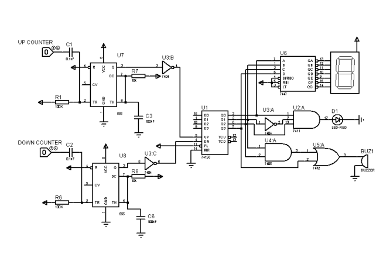

# 🚗 Car Parking Management System
**A Bi-Directional Counter using Laser Detection System**

## 📝 Project Overview
This project implements an automated car parking management system using digital logic design. The system provides real-time tracking of available parking slots through a laser detection system integrated with a digital counter circuit. When vehicles enter or exit the parking facility, the system automatically updates the count and provides visual and audio alerts when the parking capacity is reached.

## 🎯 Key Features
- Real-time vehicle counting using a laser detection system
- Bi-directional counting (entry and exit tracking)
- 7-segment display for available slots visualization
- Automatic alerts (LED and buzzer) when parking is full
- Robust error handling and debouncing using 555 timer ICs

## 🔧 Technical Specifications
### Core Components:
| Component       | Specification                       |
|-----------------|-------------------------------------|
| Counter IC      | 74193 (4-bit binary synchronous counter) |
| Decoder         | 7448 (BCD to 7-segment decoder)     |
| Logic Gates     | 7404 (NOT), 7411 (AND), 7408 (AND), 7432 (OR) |
| Timer           | 555 Timer IC (x2) for input debouncing |
| Laser Sensors   | 650nm, 5mW laser diode module with photodetectors |

### Additional Components:
- 7-segment display for count visualization
- LED indicator (Red) for capacity warning
- Buzzer for audio alerts
- Resistors (330Ω for display, 10kΩ for pull-up)
- Decoupling capacitors (0.1μF)
- 5V DC power supply
## ⚡ Implementation Details
The system utilizes a comprehensive digital logic design approach:
- **Counter Logic:** 74193 IC handles bi-directional counting based on sensor inputs.
- **Display System:** 7448 decoder converts binary output to 7-segment display format.
- **Input Processing:** 555 timers ensure clean, debounced signals from laser sensors.
- **Alert System:** Combinational logic triggers LED and buzzer when capacity is reached.

## 🛠️ Development Tools
- **Simulation:** Proteus 8.13 Pro
- **Hardware Prototyping:** Breadboard/PCB implementation

## 📷 Project Circuit Diagram

## 🎯 Key Achievements
- Successful integration of laser detection with the digital counting system
- Accurate real-time tracking and display of parking availability
- Robust error handling through hardware debouncing
- Reliable alert system for capacity management

## ⚠️ Technical Challenges & Solutions
- **Counter Synchronization:** Resolved by switching from 74LS192 to 74193 synchronous counter.
- **Signal Stability:** Implemented 555 timer-based debouncing.
- **Voltage Regulation:** Added appropriate resistor networks for component protection.
- **Circuit Complexity:** Developed an organized layout with careful component placement.

## 👥 Contributors
- Muhammad Ahmad Amjad (2023361)
- Muhammad Zayan (2023554)
- Muhammad Haris (2023428)
- Abdullah Ejaz Janjua (2023038)

## 📚 Course Information
Developed as part of **Digital Logic Design (CE-221)** under the guidance of:
- **Instructor:** Sir Ahsan Shah
- **Lab Instructor:** Miss Jazia

---

*Note: This project demonstrates practical application of digital electronics principles in solving real-world parking management challenges.*
