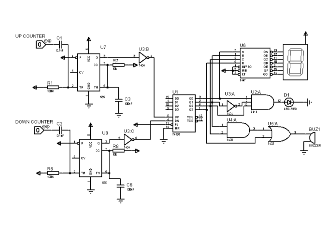

<body>
    <h1>🚗 Car Parking Management System</h1>
    
<strong>A Bi-Directional Counter using Laser Detection System</strong>

    <h2>📝 Project Overview</h2>
    
This project implements an automated car parking management system using digital logic design. The system provides real-time tracking of available parking slots through a laser detection system integrated with a digital counter circuit. When vehicles enter or exit the parking facility, the system automatically updates the count and provides visual and audio alerts when the parking capacity is reached.

    <h2>🎯 Key Features</h2>
    <ul>
        <li>Real-time vehicle counting using laser detection system</li>
        <li>Bi-directional counting (entry and exit tracking)</li>
        <li>7-segment display for available slots visualization</li>
        <li>Automatic alerts (LED and buzzer) when parking is full</li>
        <li>Robust error handling and debouncing using 555 timer ICs</li>
    </ul>
    <h2>🔧 Technical Specifications</h2>
    <h3>Core Components:</h3>
    <table>
        <tr>
            <th>Component</th>
            <th>Specification</th>
        </tr>
        <tr>
            <td>Counter IC</td>
            <td>74193 (4-bit binary synchronous counter)</td>
        </tr>
        <tr>
            <td>Decoder</td>
            <td>7448 (BCD to 7-segment decoder)</td>
        </tr>
        <tr>
            <td>Logic Gates</td>
            <td>7404 (NOT), 7411 (AND), 7408 (AND), 7432 (OR)</td>
        </tr>
        <tr>
            <td>Timer</td>
            <td>555 Timer IC (x2) for input debouncing</td>
        </tr>
        <tr>
            <td>Laser Sensors</td>
            <td>650nm, 5mW laser diode module with photodetectors</td>
        </tr>
    </table>
    <h3>Additional Components:</h3>
    <ul>
        <li>7-segment display for count visualization</li>
        <li>LED indicator (Red) for capacity warning</li>
        <li>Buzzer for audio alerts</li>
        <li>Resistors (330Ω for display, 10kΩ for pull-up)</li>
        <li>Decoupling capacitors (0.1μF)</li>
        <li>5V DC power supply</li>
    </ul>
    <h2>⚡ Implementation Details</h2>
    
The system utilizes a comprehensive digital logic design approach:

    <ul>
        <li><strong>Counter Logic:</strong> 74193 IC handles bi-directional counting based on sensor inputs</li>
        <li><strong>Display System:</strong> 7448 decoder converts binary output to 7-segment display format</li>
        <li><strong>Input Processing:</strong> 555 timers ensure clean, debounced signals from laser sensors</li>
        <li><strong>Alert System:</strong> Combinational logic triggers LED and buzzer when capacity is reached</li>
    </ul>
    <h2>🛠️ Development Tools</h2>
    <ul>
        <li><strong>Simulation:</strong> Proteus 8.13 Pro</li>
        <li><strong>Hardware Prototyping:</strong> Breadboard/PCB implementation</li>
    </ul>
    <h2>Project Ciruit Diagram</h2>
   
    <h2>🎯 Key Achievements</h2>
    <ul>
        <li>Successful integration of laser detection with digital counting system</li>
        <li>Accurate real-time tracking and display of parking availability</li>
        <li>Robust error handling through hardware debouncing</li>
        <li>Reliable alert system for capacity management</li>
    </ul>
    <h2>⚠️ Technical Challenges & Solutions</h2>
    <ul>
        <li><strong>Counter Synchronization:</strong> Resolved by switching from 74LS192 to 74193 synchronous counter</li>
        <li><strong>Signal Stability:</strong> Implemented 555 timer-based debouncing</li>
        <li><strong>Voltage Regulation:</strong> Added appropriate resistor networks for component protection</li>
        <li><strong>Circuit Complexity:</strong> Developed organized layout with careful component placement</li>
    </ul>
    <h2>👥 Contributors</h2>
    <ul>
        <li>Muhammad Ahmad Amjad (2023361)</li>
        <li>Muhammad Zayan (2023554)</li>
        <li>Muhammad Haris (2023428)</li>
        <li>Abdullah Ejaz Janjua (2023038)</li>
    </ul>
    <h2>📚 Course Information</h2>
    
Developed as part of Digital Logic Design (CE-221) under the guidance of:

    <ul>
        <li><strong>Instructor:</strong> Sir Ahsan Shah</li>
        <li><strong>Lab Instructor:</strong> Miss Jazia</li>
    </ul>
    <footer>
        
<em>Note: This project demonstrates practical application of digital electronics principles in solving real-world parking management challenges.</em>

    </footer>
</body>
</html>
